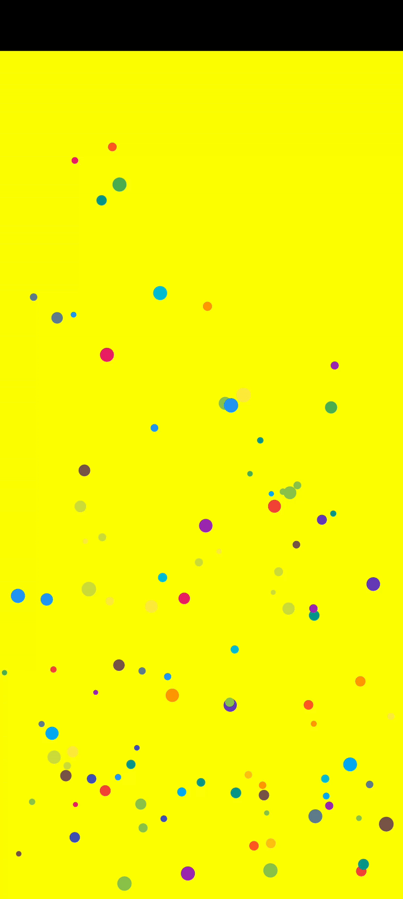
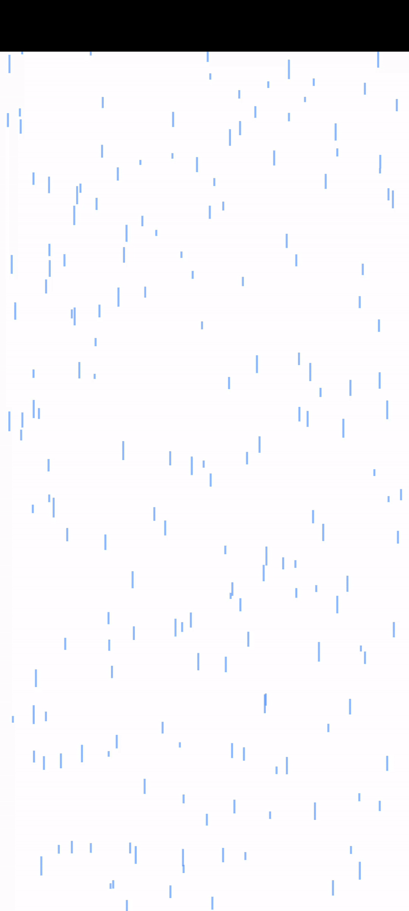
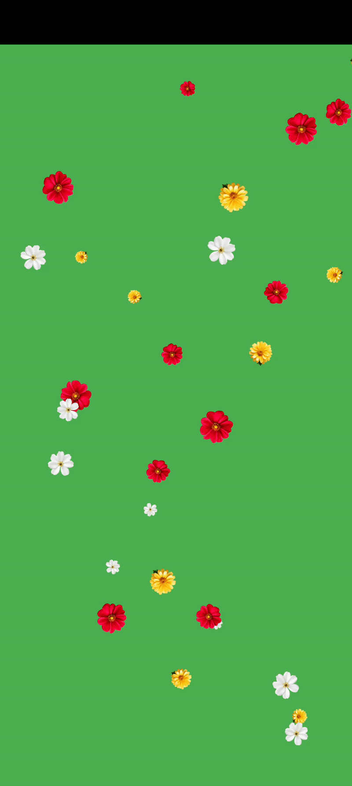

## 🎉 Flutter Confetti Effects
A versatile Flutter package that brings excitement and fun to your app with six unique types of confetti animations! Perfect for celebrations, achievements, or simply adding a touch of visual delight to your app.

## 🌟 Features and Usages
Add confetti animations to your Flutter app with minimal setup. Customize colors, particle sizes, and more to suit your app's style.
This package provides six ready-to-use confetti pages, each designed for different scenarios:

### Explosion Confetti
A dynamic and exciting burst of confetti particles radiating outward, ideal for highlighting major achievements or celebrations.


```dart
import 'package:knight_confetti/knight_confetti.dart';
ExplosionConfetti(
  totalParticles: 100, // Total number of particles
  colors: Colors.primaries, // Different colors for explosions
  positions: [] // Add initial positions for the explosions
  delay: Duration(seconds: 2), // Add delay for the initial explosions
);
```

### Firework Confetti
Stunning firework-style confetti animations that shoot up and explode with vibrant particles. Perfect for festive events and grand reveals.


```dart
import 'package:knight_confetti/knight_confetti.dart';
FireworksConfetti(
  totalParticles: 100, // Total number of particles
  colors: Colors.primaries, // Different colors for fireworks
  positions: [] // Add initial positions for the fireworks
  delay: Duration(seconds: 2), // Add delay for the initial fireworks
)
```

### Floating Confetti
Gentle floating confetti particles that gracefully drift across the screen. Great for creating a calm and magical atmosphere.




```dart
import 'package:knight_confetti/knight_confetti.dart';
FloatingConfetti(
  totalParticles: 100, // Total number of particles
  colors: Colors.primaries, // Different colors for floatings
)
```

### Rain Confetti
A rain-like effect where confetti particles fall smoothly from the top of the screen, bringing a continuous celebratory vibe.



```dart
import 'package:knight_confetti/knight_confetti.dart';
RainConfetti(
  totalParticles: 300, // Total number of particles
  color: Colors.blueAccent.withOpacity(0.6), // 
)
```

### Snow Confetti
Beautiful snow-like confetti animations, creating a serene and wintery effect. Ideal for holiday themes and seasonal designs.


```dart
SnowConfetti(
  totalParticles: 150, // Total number of particles
  color: Colors.white.withOpacity(0.9),
)
```

### Widget Confetti
Confetti integrated with widgets, allowing you to create custom animations around or within UI elements for interactive designs.



```dart
WidgetConfetti(
  totalParticles: 30, // Total number of particles
  children: , // Add list of widgets
)
```

## Author
This package is developed by Atirek Pothiwala.
